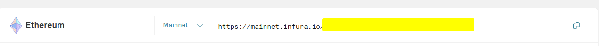
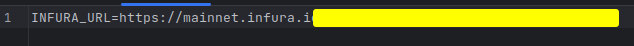

# Snipe_new_token-Bot

Bienvenue dans le référentiel du Snipe_new_token-Bot ! Ce bot a été conçu pour vous aider à trouver de nouveaux tokens dans la blockchain en utilisant une approche automatisée et efficace. Le bot parcourt la blockchain Ethereum ou son EVM à la recherche de nouveaux tokens émis, vous permettant ainsi d'explorer facilement les dernières opportunités d'investissement ou de suivre les tendances émergentes.

# Comment ça fonctionne ?

Le Snipe_new_token-Bot utilise une combinaison de techniques de scan et d'analyse de la blockchain pour détecter les nouveaux tokens. Il se base sur les données disponibles dans la blockchain, notamment sur l'émission de nouveaux blocs, les transactions contenant des tokens et les contrats intelligents. Le bot se connecte à différentes blockchains populaires telles que Ethereum, Binance Smart Chain ou Polygon (c'est à vous de choisir !) et collecte des informations pertinentes sur les nouveaux tokens émis, tels que leur nom, leur symbole et leur offre.

# Comment utiliser le Snipe_new_token-Bot ?

- Installation de Python : Rendez-vous sur https://www.python.org/ pour installer Python.
- Clonez ce repo ou Téléchargez le en .zip avant de l'extraire.

```git clone git@github.com:0xCurtis/Fork_Snipe_new_token-Bot.git```

- Ouvrez un terminal dans le dossier que vous venez d'extraire/cloner
- ```pip install -r requirements.txt```
- Renommez le fichier .env_template en .env et collez votre URL [Infura](https://app.infura.io)


- python Thebot.py

N'hésitez pas à explorer les fonctionnalités du bot en examinant le code source et en apportant vos propres améliorations ! Les contributions visant à améliorer le Snipe_new_token-Bot sont les bienvenues !

# Avertissement

Veuillez noter que le Snipe_new_token-Bot est fourni à titre informatif uniquement et ne constitue en aucun cas un conseil financier. Assurez-vous de mener vos propres recherches approfondies avant de prendre des décisions d'investissement.

# Contact

Si vous avez des questions, des suggestions ou des commentaires, n'hésitez pas à me contacter sur Twitter [@Mahfq](https://twitter.com/Mahfq).

Fork by [@0xCurtisuke](https://twitter.com/0xCurtisuke) on Twitter.

